# 🗺️ Execution Blueprint — lorenztazan.com Portfolio

> **Target Repo:** [AIKUSAN/portfolio](https://github.com/AIKUSAN/portfolio)
> **Tech Stack:** Next.js 16 · React 19 · Tailwind CSS 4 · Framer Motion 12
> **Generated by:** Lead Orchestrator Agent — Phase 0

---

## Sub-Agent Dispatch Matrix

```mermaid
graph TD
    ORCH["🧠 Lead Orchestrator<br/>PLANNING ONLY"]
    DEVOPS["🔧 DevOps-Git-02"]
    SECOPS["🔒 SecOps-Auditor-03"]
    DOCWR["📝 Doc-Writer-04"]

    ORCH --> DEVOPS
    ORCH --> SECOPS
    ORCH --> DOCWR

    DEVOPS --> D1["Branch Management"]
    DEVOPS --> D2["PR Assembly"]

    SECOPS --> S1["Vulnerability Scan"]
    SECOPS --> S2["Security Audit"]
    SECOPS --> S3["Dependency Audit"]

    DOCWR --> W1["SEO Optimization"]
    DOCWR --> W2["Markdown/Doc Polish"]
```



---

## 🔧 DevOps-Git-02 — Execution Plan

### Skills

- Native `git` tooling (no skill package available; use built-in runtime capabilities)

### Directives

1. **Branch Strategy:** Create feature branches from `main` using `feature/<agent-id>/<scope>` naming
2. **Commit Hygiene:** Conventional commits (`fix:`, `feat:`, `docs:`, `chore:`)
3. **PR Assembly:** After SecOps and Doc-Writer complete their work, assemble a single PR collecting all changes with a comprehensive description
4. **Conflict Resolution:** Rebase feature branches onto `main` before PR submission

### Pre-Conditions

- Verify `main` branch is clean and up-to-date
- Ensure CI/CD passes on `main` before branching

---

## 🔒 SecOps-Auditor-03 — Execution Plan

### Skills

| Task | Skill to Load | Path |
|---|---|---|
| OWASP Top 10 scan | `vulnerability-scanner` | `skills/vulnerability-scanner/SKILL.md` |
| Codebase security audit | `security-audit` | `skills/security-audit/SKILL.md` |
| Dependency vulnerability check | `dependency-upgrade` | `skills/dependency-upgrade/SKILL.md` |

### Directives

1. **Vulnerability Scan:**
   - Load `skills/vulnerability-scanner/SKILL.md` instructions
   - Execute `skills/vulnerability-scanner/scripts/security_scan.py` against the portfolio codebase
   - Generate findings report in `SECURITY_FINDINGS.md`

2. **Security Audit:**
   - Load `skills/security-audit/SKILL.md` instructions
   - Audit all API routes, environment variable handling, and auth flows
   - Check for XSS, CSRF, and injection vectors in Next.js pages
   - Flag any exposed secrets or hardcoded credentials

3. **Dependency Audit:**
   - Load `skills/dependency-upgrade/SKILL.md` instructions
   - Run `npm audit` and cross-reference with skill guidance
   - Optionally also reference `skills/dependency-management-deps-audit/SKILL.md` for advanced auditing
   - Propose `package.json` updates for any critical/high vulnerabilities

### Output

- `SECURITY_FINDINGS.md` at project root
- Updated `package.json` / `package-lock.json` if dependency patches needed

---

## 📝 Doc-Writer-04 — Execution Plan

### Skills

| Task | Skill to Load | Path |
|---|---|---|
| SEO audit & optimization | `seo-audit` (primary) | `skills/seo-audit/SKILL.md` |
| Meta tag optimization | `seo-meta-optimizer` | `skills/seo-meta-optimizer/SKILL.md` |
| Semantic HTML structure | `seo-structure-architect` | `skills/seo-structure-architect/SKILL.md` |
| Rich snippets | `seo-snippet-hunter` | `skills/seo-snippet-hunter/SKILL.md` |
| Markdown best practices | `writing-skills` | `skills/writing-skills/anthropic-best-practices.md` |

### Directives

1. **SEO Optimization:**
   - Load `skills/seo-audit/SKILL.md` and run full audit against all pages
   - Load `skills/seo-meta-optimizer/SKILL.md` to review/improve all `<meta>` tags, Open Graph, and Twitter cards
   - Load `skills/seo-structure-architect/SKILL.md` to validate heading hierarchy (single `<h1>` per page) and semantic HTML
   - Load `skills/seo-snippet-hunter/SKILL.md` to add JSON-LD structured data where applicable

2. **Documentation Polish:**
   - Load `skills/writing-skills/anthropic-best-practices.md` for markdown style guide
   - Audit and update `README.md` for clarity, badges, and setup instructions
   - Ensure all documentation follows consistent tone and formatting

### Output

- Updated `layout.tsx` / `page.tsx` files with improved meta tags (propose via diff, do NOT directly modify)
- `SEO_REPORT.md` at project root
- Updated `README.md`

---

## ⚡ Bonus Skills Available

These skills were discovered during research and may be dispatched as needed:

| Skill | Path | Use Case |
|---|---|---|
| `interactive-portfolio` | `skills/interactive-portfolio/SKILL.md` | Portfolio-specific design patterns |
| `senior-architect` | `skills/senior-architect/SKILL.md` | Architecture review & recommendations |
| `testing-qa` | `skills/testing-qa/SKILL.md` | Test coverage analysis |
| `dx-optimizer` | `skills/dx-optimizer/SKILL.md` | Dev experience improvements |
| `seo-content-auditor` | `skills/seo-content-auditor/SKILL.md` | Content quality for SEO |
| `api-security-testing` | `skills/api-security-testing/SKILL.md` | API-specific security testing |

---

## Execution Order

```
1. DevOps-Git-02  → Create feature branches
2. SecOps-Auditor-03 → Run all scans (parallel-safe)
3. Doc-Writer-04  → Run SEO audit & doc polish (parallel-safe)
4. DevOps-Git-02  → Collect outputs, assemble PR
```

> [!CAUTION]
> **Lead Orchestrator will NOT modify source code.** All proposed changes are blueprints for sub-agents to execute.
